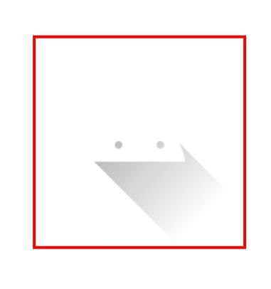
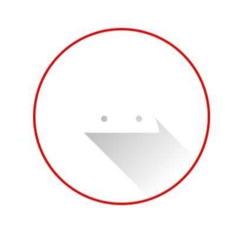
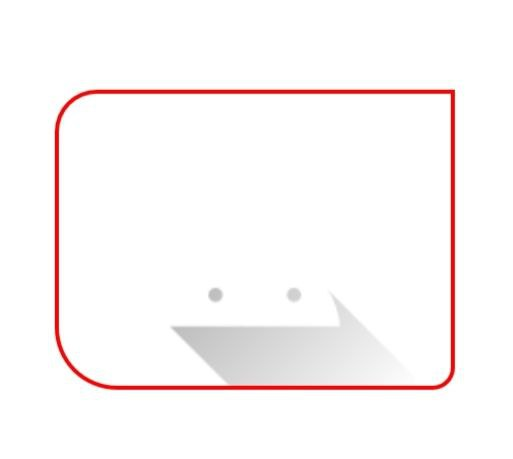

# Shapable Image Library

[](https://kotlinlang.org/)
[](LICENSE)
[](#)

**Shapable Image Library** is a custom Android `ImageView` that allows developers to display images in **circle, oval, rounded rectangle**, or **custom corner shapes** with optional borders.  

---
## How To Use
Just Add the Dependency 
```
dependencies {
	        implementation("com.github.Excelsior-Technologies-Community:ShapableImageLibrary:v1.0.1")
	}
```
---
## 📸 Preview

| Circle | Rounded Rectangle | Oval | Custom Corners |
|--------|-----------------|------|----------------|
|  |  |  |  |

---
## ✨ Features

- Supports **Circle**, **Oval**, **Rounded Rectangle** shapes.  
- Supports **custom corner radius per corner**.  
- Optional **border** with configurable width and color.  
- Works with `BitmapShader` for smooth scaling.  
- Fully XML and programmatically configurable.  
- Lightweight: only extends `AppCompatImageView`.  

---
**Usage in XML**
```xml
<com.ext.shapableimagelibrary.ShapableImageView
    android:layout_width="200dp"
    android:layout_height="150dp"
    android:src="@drawable/ic_launcher_foreground"
    android:scaleType="centerCrop"
    app:shapeType="circle"
    app:borderWidth="2dp"
    app:borderColor="#FF0000"
    app:cornerRadius="20dp"
    app:cornerTopLeft="30dp"
    app:cornerTopRight="0dp"
    app:cornerBottomLeft="20dp"
    app:cornerBottomRight="10dp"/>
```
---

**Behavior Rules**

**If any corner radius > 0, the image is drawn as a rounded rectangle and shapeType is ignored.**

If all corner radii = 0, shapeType is used:

**"circle"** → Circle

**"rounded"** → Rounded Rectangle (uses cornerRadius)

**"oval"** → oval shape

---

**Kotlin Programmatic Usage**
```
val imageView = findViewById<ShapableImageView>(R.id.myImageView)

// Set radius for all corners
imageView.setCornerRadius(30f)

// Set individual corner radii
imageView.setCustomCorners(
    topLeft = 20f,
    topRight = 0f,
    bottomLeft = 30f,
    bottomRight = 10f
)

// Set border
imageView.setBorder(3f, Color.BLUE)
```
---
**🔧 XML Attributes**
| Attribute | Type | Default | Description |
|-----------|------|---------|-------------|
| shapeType | enum | 0 (circle) | Shape of the image: circle, rounded, oval |
| cornerRadius | dimension | 0dp | Radius for all corners (rounded shape) |
| cornerTopLeft | dimension | 0dp | Top-left corner radius |
| cornerTopRight | dimension | 0dp | Top-right corner radius |
| cornerBottomLeft | dimension | 0dp | Bottom-left corner radius |
| cornerBottomRight | dimension | 0dp | Bottom-right corner radius |
| borderColor | color | #FFFFFF | Border color |
| borderWidth | dimension | 0dp | Border width |
---
**Methods**
```
fun setCornerRadius(radius: Float) // Set radius for all corners
fun setCustomCorners(topLeft: Float, topRight: Float, bottomLeft: Float, bottomRight: Float) // Custom corners
fun setBorder(width: Float, color: Int) // Set border width and color
```
---


    
